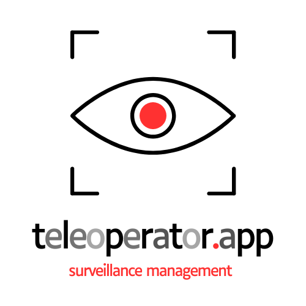

 [<span style='font-size:20px;'>&#x270D;</span>](https://github.com/teleoperator-app/www/edit/main/docs/HEAD.md)

[](https://github.com/teleoperator-app/www/stargazers) [](https://github.com/teleoperator-app/www/fork) [](https://github.com/teleoperator-app/www/watchers) [](https://github.com/teleoperator-app) [](https://hits.seeyoufarm.com)

## MENU [<span style='font-size:20px;'>&#x270D;</span>](https://github.com/teleoperator-app/www/edit/main/docs/MENU.md)

Support i Helpdesk - [help.teleoperator.app](http://help.teleoperator.app)

Panel Klienta - [client.teleoperator.app](http://client.teleoperator.app)

Panel Instalatora - [service.teleoperator.app](http://service.teleoperator.app)

Panel Producenta - [product.teleoperator.app](http://product.teleoperator.app)


+ [Detekcja obiektów w systemach wizyjnych - Raport www - Jak zmieniał się rynek systemów wizyjnych w zastosowaniach przemysłowych w ostatniej dekadzie? Jak zmieni się rynek do roku 2030?](https://www.teleoperator.info/)
+ [CCTV 2024 - Global Report](http://cctv.teleoperator.info)

## Cel projektu [<span style='font-size:20px;'>&#x270D;</span>](https://github.com/teleoperator-app/www/edit/main/docs/MAIN.md)

**teleoperator.app** łączy instalatorów kamer i systemów monitoringu, producentów oraz klientów końcowych,

## Grupa docelowa

dla instalatorów kamer i systemów monitoringu, marketplace dla producentów do tworzenia oferta 
oraz panel dla klientów do zamawiania produktów i usług oraz rozliczania i supportu. 


### Przykłady użycia aplikacji

- klient końcowy szuka instalatora, który pracuje w regionie i wykonuje daną usługę. Klient wybiera z listy dostępne terminy i maksymalny koszt usługi.
- instalator otrzymuje powiadomienie o zleceniu i akceptuje bądź proponuje inne warunki wykonania usługi, lub prosi o dodatkowe dane.
- klient udostępnia fotografie obiektu, opisuje głosowo lub tekstowo oczekiwania,
- instalator warunki wykonania zlecenia, oferuje listę usług oraz produktów z marketplace
- system tworzy umowę dla zleceniodawcy i zleceniobiorcy
- w panelu klienta pojawia się  umowa do akceptacji i zapłaty, status wykonania zlecenia,
- po wykonaniu zlecenia zleceniodawca  otrzymuje zapłatę za usługę i wystawia ocenę dla zlecniodawcy
- zleceniobiorca wystawia ocenę zleceniodawcy

## Techniczne Zasady i Wymagania [<span style='font-size:20px;'>&#x270D;</span>](https://github.com/teleoperator-app/www/edit/main/docs/PLAN.md)

Plan zapewnia pełne pokrycie ważnych funkcjonalności dla wszystkich użytkowników aplikacji, dostosowane do potrzeb instalatorów, producentów oraz klientów końcowych.

- **Backend**: Architektura oparta na mikrousługach, np. RESTful API.
- **Frontend**: Technologie jak React.js, Angular albo Vue.js.
- **Baza Danych**: Relacyjna baza danych jak PostgreSQL lub MySQL.
- **System Powiadomień**: Push notifications, email, SMS.
- **Bezpieczeństwo**: Autoryzacja i uwierzytelnianie przez OAuth2.0, ochrona danych użytkowników, szyfrowanie.
- **Hosting**: Chmura (AWS, Google Cloud, Azure) dla skalowalności i niezawodności.
- **Integracje Płatności**: PayPal, Stripe, tradycyjne przelewy bankowe.

## Strona Główna  - [menu.teleoperator.app](http://menu.teleoperator.app) [<span style='font-size:20px;'>&#x270D;</span>](https://github.com/teleoperator-app/www/edit/main/docs/PANEL.md)

Specyfikacja Interfejsu UI/UX

- **Menu Główne**: Zakładki takie jak "Znajdź Instalatora", "Produkty", "Moje konto", "Pomoc".
- **Pole Wyszukiwania**: Umożliwiające wyszukiwanie instalatorów lub produktów.
- **Panel Logowania/Rejestracji**: Korzystający z systemu mogą się zalogować, zarejestrować lub odzyskać hasło.

## Panel Klienta - [client.teleoperator.app](http://client.teleoperator.app) [<span style='font-size:20px;'>&#x270D;</span>](https://github.com/teleoperator-app/www/edit/main/docs/KLIENT.md)

- **Wyszukiwanie Instalatora**:
  - **Filtry Wyszukiwania**: Lokalizacja, dostępność, recenzje, koszt maksimum.
  - **Lista Instalatorów**: Z profilem, dostępnością terminów, recenzjami i cennikami usług.
  - **Rezerwacja Terminu**: Kalendarz z wolnymi terminami do rezerwacji.
  - **Opcje Komunikacji**: Formularz do opisu zlecenia tekstowo, oraz możliwość dodania zdjęć obiektu i notatek głosowych.

- **Marketplace**: 
  - **Przeglądanie**: Katalog produktów i usług. 
  - **Szczegóły Produktu**: Opis, specyfikacja, cena, opinie.
  - **Dodanie do Koszyka**: Możliwość zakupu produktów dołączonych do zlecenia.

- **Panel Zamówień i Zleceń**:
  - **Moje Zlecenia**: Lista aktywnych i zakończonych zleceń.
  - **Status Zlecenia**: Krok po kroku, od akceptacji zlecenia, przez realizację, po akceptację końcową.
  - **Umowy i Płatności**: Sekcja do przeglądania umów, wykonywania płatności i monitorowania statusu.

- **Oceny i Recenzje**:
  - **Wystawianie Oceny**: Po zakończeniu zlecenia możliwość ocenienia instalatora.
  - **Podgląd Recenzji**: Możliwość przeglądania wystawionych opinii.

## Panel Instalatora - [service.teleoperator.app](http://service.teleoperator.app) [<span style='font-size:20px;'>&#x270D;</span>](https://github.com/teleoperator-app/www/edit/main/docs/INSTALATOR.md)

- **Dashboard**:
  - **Powiadomienia**: Informacje o nowych zleceniach, wymaganych akcjach, wiadomościach od klientów.
  - **Mój Kalendarz**: Widok dostępnych terminów i zarezerwowanych usług.

- **Zarządzanie Zleceniami**:
  - **Akceptacja/Propozycje Zmian**: Opcje do przyjęcia zlecenia, sugerowania zmian lub żądania dodatkowych danych.
  - **Wysyłanie Ofert**: Wybór produktów i usług z marketplace do załączenia w ofercie.

- **Umowy i Rozliczenia**: 
  - **Podgląd Umowy**: Czytanie, zatwierdzanie i podpisywanie umów.
  - **Statusy Płatności**: Monitorowanie płatności za zlecenia.

- **Oceny Klientów**: 
 - **Wystawianie Oceny**: Możliwość ocenienia klientów po zakończeniu zlecenia.

## Panel Producenta - [product.teleoperator.app](http://product.teleoperator.app) [<span style='font-size:20px;'>&#x270D;</span>](https://github.com/teleoperator-app/www/edit/main/docs/PRODUCENT.md)

- **Dodawanie Produktów**:
  - **Formularz Dodawania**: Formularz do wprowadzania informacji o nowych produktach, w tym opisów, zdjęć, cen, stanów magazynowych.

- **Zarządzanie Ofertami**: 
  - **Edycja Produktów**: Możliwość aktualizacji informacji o istniejących produktach.
  - **Śledzenie Zamówień**: Widok wszystkich zamówień, statusy realizacji.

## Support i Helpdesk - [help.teleoperator.app](http://help.teleoperator.app) [<span style='font-size:20px;'>&#x270D;</span>](https://github.com/teleoperator-app/www/edit/main/docs/SUPPORT.md)

- **Baza Wiedzy**: Artykuły, FAQ, poradniki.
- **Kontakt**: Formularz kontaktowy, live chat, numer telefonu do wsparcia.

## Scenariusze Użycia [<span style='font-size:20px;'>&#x270D;</span>](https://github.com/teleoperator-app/www/edit/main/docs/USECASE.md)

### 1. Klient szuka instalatora

1. **Klient** loguje się do aplikacji i wybiera opcję "Znajdź Instalatora".
2. **Klient** używa filtrów, aby zawęzić wyszukiwanie do instalatorów działających w jego regionie i posiadających odpowiednie oceny oraz pasujący koszt usługi.
3. **Klient** przegląda profile instalatorów i wybiera interesującego go instalatora.
4. **Klient** rezerwuje dostępny termin w kalendarzu instalatora oraz załącza zdjęcia obiektu i opis wymagań.
5. **Instalator** otrzymuje powiadomienie o nowym zleceniu, przegląda szczegóły i akceptuje zlecenie lub sugeruje zmiany.
6. **System** automatycznie tworzy i przesyła proponowaną umowę do klienta.
7. **Klient** akceptuje umowę i dokonuje płatności przez panel.
8. **Instalator** realizuje zlecenie.
9. **Klient** ocenia instalatora po zakończeniu usługi.
10. **Instalator** ocenia klienta.

### 2. Producent dodaje nowy produkt

1. **Producent** loguje się do swojego panelu.
2. **Producent** wybiera opcję "Dodaj Produkt".
3. **Producent** wypełnia formularz, dołączając wszystkie niezbędne informacje i zdjęcia.
4. **Produkt** pojawia się w marketplace, gotowy do przeglądania przez klientów i instalatorów.

## About us [<span style='font-size:20px;'>&#x270D;</span>](https://github.com/teleoperator-app/www/edit/main/docs/FOOT.md)
+ [softreck.com](http://softreck.com)
+ [telemonit.com](http://telemonit.com)


<script type="module">    
  import mermaid from 'https://cdn.jsdelivr.net/npm/mermaid@10/dist/mermaid.esm.min.mjs';
  //import mermaid from 'https://cdn.jsdelivr.net/npm/mermaid@10.8.0/dist/mermaid.min.js';
  mermaid.initialize({
    startOnReady:true,
    theme: 'forest',
    flowchart:{
            useMaxWidth:false,
            htmlLabels:true
        }
  });
  mermaid.init(undefined, '.language-mermaid');
</script>


---

## Star History [<span style='font-size:20px;'>&#x270D;</span>](https://github.com/teleoperator-app/www/edit/main/CONTRIBUTE/CONTRIBUTE.md)

[](https://star-history.com/#teleoperator-app/www&Date)


## [Contributions](http://contribution.softreck.dev)

[CONTRIBUTION](CONTRIBUTION.md) are always welcome:
+ did you found an [Issue or Mistake](https://github.com/teleoperator-app/www/issues/new)?
+ do you want to [improve](https://github.com/teleoperator-app/www/edit/main/README.md) the article?
+ are you interested do join another [git projects](https://github.com/teleoperator-app/)?
+ have something to contribute or discuss? [Open a pull request](https://github.com/teleoperator-app/www/pulls) or [create an issue](https://github.com/teleoperator-app/www/issues).

 [<span style='font-size:20px;'>&#x270D;</span>](https://github.com/teleoperator-app/www/edit/main/CONTRIBUTE/STRUCTURE.md)

### Inicjalizacja projektu React.js

1. **Zainstaluj Node.js i npm**: Najpierw upewnij się, że masz zainstalowany Node.js i npm.
2. **Utworzenie nowego projektu React**:
   ```sh
   git clone 
   cd www
   npx create-react-app .   
   npm start
   ```


### Struktura Folderów

Upewnij się, że Twoje katalogi mają poniższą strukturę:

```
teleoperator-app/
├── backend/
│   ├── Dockerfile
│   ├── package.json
│   ├── package-lock.json
│   ├── server.js
│   └── ...inne_pliki_backendu...
├── src/
│   ├── components/
│   │   ├── Header.js
│   │   ├── Footer.js
│   │   ├── InstallerList.js
│   │   ├── Marketplace.js
│   │   ├── Dashboard.js
│   │   └── ...
│   ├── App.js
│   ├── App.css
│   └── index.js
├── Dockerfile
├── docker-compose.yml
├── package.json
├── package-lock.json
├── public/
└── ...inne_pliki_frontendu...
```

## Node Install [<span style='font-size:20px;'>&#x270D;</span>](https://github.com/teleoperator-app/www/edit/main/CONTRIBUTE/NODE.md)


Po zapisaniu pliku `package.json`, uruchom następującą komendę w terminalu, aby zainstalować wszystkie zależności:

```sh
cd src
```

```sh
npm install
```

To upgrade all the dependencies in your `package.json` to their latest versions, you can follow these steps:

### Using npm (version 5.2 or higher)

1. **Install `npm-check-updates`:**
   First, you need to install the `npm-check-updates` tool globally. This tool helps you to easily upgrade the dependencies in your `package.json` to the latest versions.

   ```sh
   sudo npm install -g npm-check-updates
   ```

   ```sh
   sudo npm install -g npm@10.8.1
   ```
2. **Update `package.json` Dependencies:**
   Once `npm-check-updates` is installed, run the following command to upgrade your `package.json` dependencies:

   ```sh
   ncu -u
   ```

   The `ncu -u` command checks your `package.json` file for any outdated dependencies and updates them to the latest versions.

3. **Install Updated Dependencies:**
   After updating the `package.json` file, install the updated packages using:

   ```sh
   npm install
   ```

### Using yarn

If you prefer to use `yarn`, you can update all dependencies to their latest versions as follows:

1. **Upgrade Dependencies:**
   Run the following command to upgrade all the dependencies listed in your `package.json` file:

   ```sh
   yarn upgrade --latest
   ```

### Manual Method

Alternatively, you could manually update the `package.json` file and then install the dependencies:

1. **Update Versions in `package.json`:**
   Manually change the version numbers of the dependencies in your `package.json` file to the latest versions. You can look up the latest versions on npm's website or by running:

   ```sh
   npm show <package-name> version
   ```

2. **Install Dependencies:**
   After updating the `package.json` file, run the following command to install the updated packages:

   ```sh
   npm install
   ```

### After Upgrading

After upgrading your dependencies, it's a good practice to:

1. **Check for breaking changes:**
   Review the changelogs of the dependencies to be aware of any breaking changes that might require code modifications.

2. **Test your application:**
   Thoroughly test your application to ensure everything works correctly with the updated dependencies.

3. **Lockfile Update:**
   If you use a lockfile (`package-lock.json` or `yarn.lock`), make sure it is updated by the package manager.

Following these steps should help you successfully upgrade all the packages in your `package.json` to their newest versions.

## Python Install [<span style='font-size:20px;'>&#x270D;</span>](https://github.com/teleoperator-app/www/edit/main/CONTRIBUTE/PYTHON.md)

Zainstaluj biblioteki Pythona, jeśli jeszcze tego nie zrobiłeś. Możesz to zrobić używając `pip`:

```bash
py -m pip install --upgrade pip
py -m pip install --upgrade setuptools
py -m pip install --upgrade wheel
py -m venv venv
source venv/bin/activate  # On Windows use `venv\Scripts\activate`
```

```bash
py -m pip install -r requirements.txt
```

## Uruchamianie kontenerów [<span style='font-size:20px;'>&#x270D;</span>](https://github.com/teleoperator-app/www/edit/main/CONTRIBUTE/DOCKER.md)

Pliki `Dockerfile` i `docker-compose.yml` umożliwiaj konteneryzację aplikacji React.js (src) i backendu Express, co sprawia, że aplikacja staje się bardziej przenośna i łatwa do wdrożenia. 
Dzięki Docker i Docker Compose możesz uruchomić złożone środowiska wielokontenerowe jedną komendą, co znacznie upraszcza zarządzanie i skalowanie aplikacji.


```sh
cd backend
docker build -t .
```


```sh
cd ..
```

```sh
cd src
docker build .
```

### Zbuduj i uruchom kontenery za pomocą Docker Compose:

```sh
docker compose up --build
```

### Debugowanie
Jeśli wystąpią problemy, sprawdź logi za pomocą:

```sh
docker compose logs
```

### Zatrzymywanie kontenerów

```sh
docker compose down
```


If you need your build to connect to services running on the host, you can use the special host-gateway value for --add-host. In the following example, build containers resolve host.docker.internal to the host's gateway IP.
```sh
docker build --add-host host.docker.internal=host-gateway .
```

## TODO [<span style='font-size:20px;'>&#x270D;</span>](https://github.com/teleoperator-app/www/edit/main/CONTRIBUTE/TODO.md)

Na tym etapie stworzyliśmy podstawową makietę aplikacji webowej z wykorzystaniem technologii React.js, która jest łatwa do modyfikacji.
Od inicjalizacji projektu, przez utworzenie podstawowej struktury komponentów, aż po integrację z symulowanym API (MSW).


### Podsumowanie i Następne Kroki

[ ] **Skalowanie**: W miarę potrzeb dodawaj więcej komponentów, takich jak formularze rejestracyjne, kalendarze dostępności, panele administracyjne itd.
[ ] **Backend**: Rozważ implementację rzeczywistego backendu z REST API lub GraphQL.
[ ] **Autoryzacja**: Zaimplementuj system autoryzacji, np. OAuth2.
[ ] **Testowanie**: Dodaj testy jednostkowe i integracyjne, korzystając np. z Jest i React Testing Library.
[ ] **Responsywność**: Dopracuj stylizację, aby aplikacja działała dobrze na różnych urządzeniach.


Poniżej przedstawiam plan rozwoju projektu.

### 1. Sckalowanie i Nowe Funkcjonalności

Dodanie bardziej kompleksowych komponentów takich jak:
- **Formularze Rejestracyjne**: Komponenty z walidacją np. z wykorzystaniem `formik` do łatwego zarządzania formularzami w React.js.
- **Kalendarze Dostępności**: Implementacja bardziej zaawansowanych kalendarzy z możliwością zarządzania wolnym czasem instalatorów, np. z użyciem bibliotek takich jak `react-big-calendar`.
- **Panele Administracyjne**: Widoki i funkcje dla administratorów, tj. zarządzanie użytkownikami, zamówieniami i produktami.

### 2. Backend Integration

Ciężar logiki biznesowej i przechowywania danych przenieś na backend:
- **API REST**: Zaimplementuj prawdziwe API, preferencyjnie w Node.js z Express, Django, czy innej technologii, z której korzystasz.
- **GraphQL**: Alternatywnie użyj GraphQL do bardziej elastycznego zarządzania danymi.
- **Serwery**: Hostuj backend na platformach takich jak AWS, Google Cloud, Heroku.

### 3. Uwierzytelnianie i Autoryzacja

Zaimplementuj bezpieczne logowanie i autoryzowanie użytkowników:
- **OAuth2**: Integracja z popularnymi providerami tożsamości (Google, Facebook).
- **JWT**: Użyj JSON Web Tokens do bezpiecznego przekazywania informacji o autoryzacji.

### 4. Testowanie i Utrzymanie Jakości

Wprowadź narzędzia do testowania kodu, jego analizy i ciągłej integracji:
- **Jest i React Testing Library**: Testuj komponenty oraz interakcje.
- **ESLint i Prettier**: Zapewniaj spójność kodu i szybkie wyłapywanie błędów.
- **Ciągła Integracja (CI)**: Ustaw np. w GitHub Actions, CircleCI, TravisCI.

### 5. Ulepszanie Stylizacji i Responsywności

Dostosuj aplikację do różnych urządzeń i ulepsz jej wygląd:
- **CSS-in-JS**: Rozważ użycie bibliotek takich jak `styled-components` lub `emotion`.
- **Responsywność**: Zapewnij, aby Twoje komponenty dobrze wyglądały zarówno na urządzeniach mobilnych, jak i desktopowych z pomocą `flexbox`, `grid` oraz media queries.

### 6. Monitorowanie i Optymalizacja

Monitoruj działanie aplikacji i poprawiaj jej wydajność:
- **Google Analytics**: Śledź ruch i zachowania użytkowników.
- **Logi i Monitoring**: Zaimplementuj systemy logowania błędów i monitorowania wydajności (np. Sentry, New Relic).
- **Optymalizacja Wydajności**: Przeprowadź optymalizację komponentów React używając technik takich jak lazy loading, memoization.

### 7. DevOps i Automatyzacja

Automatyzacja procesów wdrożeniowych zapewni częste i pewne wdrożenia:
- **Docker i Kubernetes**: Zautomatyzuj wdrożenia aplikacji przy użyciu konteneryzacji.
- **CI/CD**: Implementacja potoków CI/CD do automatyzacji buildów, testów i wdrożeń.

---
+ Modular Documentation made possible by the [FlatEdit](http://www.flatedit.com) project.
